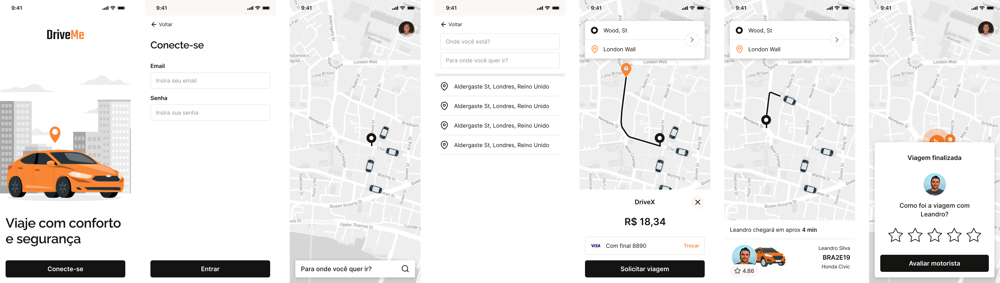

  

Backend of an individual urban transport app

🚀 In development

# About
This repository contains the backend of an individual urban transportation application, inspired by services such as Uber, Lyft and others.

The aim of this project is to improve my web development skills by exploring concepts and technologies.

(More complete documentation coming soon)

# Planning
Before I started doing any code, I tried to understand and plan how the system would work. As a result, I now have a clear and consistent overview of the project.

## Modeling
The system was modeled using the [Event Storming](https://www.ibm.com/cloud/architecture/architecture/practices/event-storming-methodology-architecture/) method. This method involves identifying important events in the business domain and organizing these events around workflows.

In this phase, I also defined the aggregates and flows of the system, as well as the expected behaviors. The result gave me a clear vision of the system and helped me plan the implementation.

## Architecture (High-level)
The system's architecture is designed to be scalable. Here I chose to use a [Modular Monolith](https://medium.com/design-microservices-architecture-with-patterns/microservices-killer-modular-monolithic-architecture-ac83814f6862) architecture, where each module is made up of a Bounded Context ([DDD](https://martinfowler.com/bliki/DomainDrivenDesign.html)), which allows us to develop, deploy and scale services independently.

Each module is responsible for a specific feature, such as user authentication, trip management, payment, etc. This keeps the code clean and organized, and makes it easier to maintain and expand the system in the future.

### System design

### Database modeling

## Design
The application has been designed to be intuitive and easy to use. Below are the main application screens for drivers and passengers that the API must satisfy.

### Main screens of the app for drivers

### Main screens of the passenger app

# Installation
🚧 Installation tutorial coming soon 🚧

# License
This project is licensed under the MIT license. See the [LICENSE](LICENSE) file for more details.
